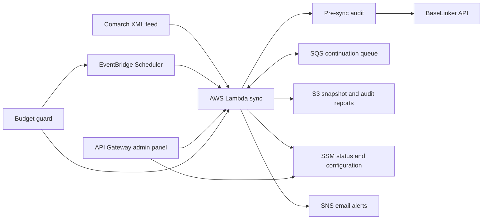

# Comarch e-Sklep → BaseLinker Sync

Serverless, audit-driven synchronization of a Comarch e-Sklep product catalog
with BaseLinker. The project was built for a real-world client deployment after
the native integration proved too limited for reliable variant relationships,
stock filtering, repeatable updates, and operational visibility.

No customer data, credentials, catalog exports, account IDs, or deployment
values are stored in this repository.

## What it does

- downloads one immutable Comarch XML snapshot per synchronization run,
- performs a full pre-sync audit against BaseLinker,
- creates, updates, and deletes only records found in the diff,
- preserves parent, variant, and standalone-variant relationships,
- filters zero-stock variants while retaining valid parent products,
- respects the BaseLinker API request limit,
- resumes work through SQS instead of paying for idle Lambda sleep,
- runs a post-sync audit and stores summarized audit output in S3,
- emails post-sync audit details and an administration portal link when the
  audit finds remaining inconsistencies or fails,
- exposes a password-protected administration panel through API Gateway,
- publishes progress and ETA through SSM Parameter Store,
- includes an AWS budget guard that can pause scheduled processing.

## Architecture



## Repository layout

- `cdk_app/` - infrastructure as code for the complete deployment.
- `src/` - main synchronization Lambda.
- `admin_src/` - password-protected status and configuration panel.
- `budget_guard_src/` - budget protection Lambda.
- `tests/` - unit tests.
- `.github/workflows/` - CI and manual deployment workflows.
- `comarch_template_full_flat.xml` - Comarch custom comparison template that
  exports products and all available attributes.

This is a single monorepo. Infrastructure and runtime code are separated by
directory, but they are versioned and deployed together. The project uses AWS
CDK, not the Serverless Framework.

## Language conventions

- Technical documentation, source code, identifiers, comments, logs, workflow
  messages, and backend-facing errors use English.
- The administration panel defaults to English and supports `en` and `pl`
  through the `CLIENT_LOCALE` deployment secret.
- Customer-specific names, colors, titles, and logos are deployment inputs and
  are not stored in the public repository.

## Local tests

```bash
python3 -m venv .venv
source .venv/bin/activate
pip install -r requirements-dev.txt -r cdk_app/requirements.txt
python -m unittest discover -s tests -p 'test_*.py'
```

## Configuration

Copy `.env.example` to `.env` for local work. `.env` is ignored by Git.

The deployment workflow uses two GitHub Environments so credentials and
resource names cannot be silently exchanged between AWS accounts:

- `client-production` for the client-owned AWS account,
- `source-rollback` for the disabled rollback environment.

Configure the following secrets separately in each environment:

| Secret | Purpose |
| --- | --- |
| `AWS_ACCESS_KEY_ID` | AWS deployment credentials |
| `AWS_SECRET_ACCESS_KEY` | AWS deployment credentials |
| `AWS_SESSION_TOKEN` | Session token when using manually refreshed temporary credentials; omit for a dedicated assume-role user |
| `PIPELINE_STACK_NAME` | Existing or new CDK pipeline stack name |
| `BUDGET_STACK_NAME` | Existing or new CDK budget stack name |
| `BUCKET_NAME` | Existing or new S3 bucket name |
| `FUNCTION_NAME` | Main Lambda name |
| `SCHEDULE_NAME` | Daily EventBridge Scheduler name |
| `ADMIN_API_NAME` | Admin HTTP API name |
| `ADMIN_FUNCTION_NAME` | Admin Lambda name |
| `BUDGET_NAME` | AWS Budget name |
| `BUDGET_GUARD_FUNCTION_NAME` | Budget guard Lambda name |
| `BUDGET_GUARD_MONTHLY_SCHEDULE_NAME` | Monthly reset schedule |
| `BUDGET_GUARD_HOURLY_SCHEDULE_NAME` | Hourly budget check schedule |
| `COMARCH_XML_URL` | Private Comarch XML export URL |
| `BL_API_TOKEN` | BaseLinker API token |
| `BL_API_TOKEN_SSM_PARAM` | SecureString parameter path |
| `BL_SYNC_STATUS_SSM_PARAM` | SSM synchronization status path |
| `BL_SYNC_CONFIG_SSM_PARAM` | SSM runtime configuration path |
| `BUDGET_FX_RATE_SSM_PARAM` | SSM USD/PLN rate path |
| `BUDGET_GUARD_STATUS_SSM_PARAM` | SSM budget guard status path |
| `BL_INVENTORY_ID` | Target BaseLinker inventory |
| `BL_WAREHOUSE_ID` | Target BaseLinker warehouse |
| `BL_API_MAX_RPM` | Request limit, normally below BaseLinker's hard limit |
| `MAKE_PUBLIC_FEED` | Keep `false` unless public S3 access is intentional |
| `ADMIN_USERNAME` | Admin panel username |
| `ADMIN_PASSWORD` | Admin panel password |
| `ADMIN_PASSWORD_SHA256` | Existing panel password hash; use instead of `ADMIN_PASSWORD` when migrating |
| `CLIENT_BRAND_NAME` | Private customer display name |
| `CLIENT_PANEL_TITLE` | Private admin panel heading |
| `CLIENT_PANEL_SUBTITLE` | Private admin panel subtitle |
| `CLIENT_LOCALE` | Administration panel language: `en` (default) or `pl` |
| `CLIENT_PRIMARY_COLOR` | Customer primary color as six-digit hex |
| `CLIENT_PRIMARY_DARK_COLOR` | Dark primary color as six-digit hex |
| `CLIENT_SECONDARY_COLOR` | Customer secondary color as six-digit hex |
| `CLIENT_LOGO_BASE64` | Private PNG logo encoded as Base64 |
| `BUDGET_ALERT_EMAIL` | AWS Budget and post-sync audit notification address |
| `BUDGET_LIMIT_USD` | Monthly budget limit |

Configure these non-secret variables separately in each environment:

| Variable | Purpose |
| --- | --- |
| `AWS_REGION` | Application region, normally `eu-north-1` |
| `AWS_ROLE_ARN` | Deployment role assumed by GitHub Actions; recommended for direct deployments without OIDC |
| `EXPECTED_AWS_ACCOUNT_ID` | Account that must match `sts:GetCallerIdentity` |
| `SYNC_ENABLED` | `false` for a staged or rollback environment; `true` only for the active account |
| `SCHEDULE_EXPRESSION` | EventBridge expression, normally `cron(0 0,12,17 * * ? *)` |
| `SCHEDULE_TIMEZONE` | EventBridge timezone, normally `Europe/Warsaw` |

`BUCKET_NAME` is intentionally required and must be globally unique. Keep the
same value for updates and rollback of one environment, and use a different
value in the other account.

For durable direct deployments without GitHub OIDC, store access keys from a
dedicated IAM user that can only call `sts:AssumeRole` on `AWS_ROLE_ARN`. Attach
the infrastructure permissions to the role, not to that IAM user. The workflow
then exchanges the long-lived bootstrap key for a one-hour role session before
it validates the account, reads the diff, or deploys resources.

The deployment is intentionally manual through **Actions → Deploy to AWS →
Run workflow**. A normal push runs tests and CDK synthesis only.

## Deployment model

The repository contains one CDK application that creates two CloudFormation
stacks:

- the pipeline stack in the configured application region, normally
  `eu-north-1`,
- the AWS Budget stack in `us-east-1`, where the AWS Budgets control plane is
  managed.

One run of the **Deploy to AWS** workflow deploys both stacks. The workflow also
performs the required operations that happen outside the CDK deployment:

1. validates required GitHub Actions secrets,
2. reconstructs the private customer logo on the ephemeral runner,
3. hashes the administration panel password,
4. stores the BaseLinker API token in SSM Parameter Store as `SecureString`,
5. bootstraps CDK in the application region,
6. runs one `cdk deploy` command for both stacks.

Therefore, one workflow run is sufficient for a complete deployment. A bare
local `cdk deploy` is not a complete replacement unless the BaseLinker token
already exists in SSM and all required CDK context values are supplied.

## Prerequisites

Before the first deployment, prepare:

- an AWS account,
- an IAM identity for deployment,
- a GitHub repository containing this project,
- a Comarch e-Sklep custom XML export URL,
- a BaseLinker API token with access to inventory products, categories,
  manufacturers, and stock,
- the target BaseLinker inventory ID and warehouse ID,
- an email address for budget and post-sync audit notifications,
- optional private customer branding encoded as GitHub Actions secrets.

The IAM deployment identity must be able to:

- bootstrap and deploy CloudFormation stacks,
- create and update IAM roles and policies,
- manage Lambda, S3, SNS, SQS, EventBridge Scheduler, API Gateway HTTP APIs,
  SSM parameters, and AWS Budgets,
- read the current AWS account identity.

For an initial private deployment, an administrator-level deployment identity
is the simplest option. For repeated or shared deployments, replace it with a
dedicated least-privilege role or GitHub OIDC role. The current workflow uses
`AWS_ACCESS_KEY_ID` and `AWS_SECRET_ACCESS_KEY`.

## First deployment

1. Create a Comarch custom comparison using
   `comarch_template_full_flat.xml`.
2. Confirm that its URL returns the complete XML feed.
3. Create a BaseLinker API token and identify the target inventory and
   warehouse.
4. Open the GitHub repository and go to **Settings → Environments**.
5. Create the environment for the target account and add its secrets and
   variables from the configuration tables above. Use temporary AWS
   credentials, including `AWS_SESSION_TOKEN`.
6. Configure `BUDGET_ALERT_EMAIL` and `BUDGET_LIMIT_USD` before enabling
   unattended operation.
7. Run the normal **CI** workflow and verify that tests, the public repository
   safety check, and CDK synthesis pass.
8. Open **Actions → Deploy to AWS → Run workflow**, select the target
   environment, choose `DIFF`, and enter `DIFF` in the confirmation field.
9. Review the complete CDK diff. It must show the synchronization schedule and
   SQS event source disabled and reserved concurrency set to zero when
   `SYNC_ENABLED=false`.
10. Run the workflow again with `DEPLOY` only after accepting that diff.
11. Wait for both CloudFormation stacks to finish successfully.
12. Confirm the SNS email subscription sent to `BUDGET_ALERT_EMAIL`. Post-sync
    audit alerts are not delivered until this one-time confirmation is complete.
13. Read the pipeline stack outputs. `AdminUrl` is the administration panel
    address; the other outputs identify the Lambda, S3 bucket, schedule, and
    SQS continuation queue.

The safe default is `SYNC_ENABLED=false`. A paused deployment has a disabled
sync schedule, a disabled SQS event source mapping, zero reserved concurrency
on the sync Lambda, and a disabled monthly budget reset that could otherwise
re-enable synchronization. Do not change `SYNC_ENABLED` to `true` until the
source account has been stopped and the cutover checks are complete.

No deployment runs automatically after a push. Only the manually confirmed
deployment workflow changes AWS resources.

## Post-deployment verification

After the first deployment:

1. Open `AdminUrl` from the pipeline stack outputs.
2. Sign in using `ADMIN_USERNAME` and `ADMIN_PASSWORD`.
3. Confirm that the displayed Comarch URL, BaseLinker inventory, warehouse,
   and request limit are correct.
4. Confirm in EventBridge Scheduler that the schedule is enabled, uses the
   `Europe/Warsaw` timezone, and runs at 00:00, 12:00, and 17:00 local time.
5. Confirm that the BaseLinker token exists at `BL_API_TOKEN_SSM_PARAM` as a
   `SecureString`.
6. Run a manual synchronization from the administration panel.
7. Verify that the panel reaches the post-sync audit and reports no remaining
   inconsistencies.
8. Verify the audit summary and details objects in the deployment S3 bucket.
9. Confirm that the AWS Budget exists and that budget notification emails are
   delivered.
10. Confirm that the post-sync audit SNS subscription is active. Alerts include
    the audit counters, S3 artifact locations, and `AdminUrl` when the final
    audit reports a non-zero difference count or an audit error.

Use a test BaseLinker inventory and warehouse for the first deployment. Change
to production targets only after a successful audit and manual data review.

## Updating an existing deployment

Application and infrastructure changes use the same process:

1. commit and push the change,
2. wait for the **CI** workflow to pass,
3. review the CDK changes when the infrastructure definition was modified,
4. manually run **Deploy to AWS** and enter `DEPLOY`,
5. verify the CloudFormation result and administration panel.

Keep stack names, bucket name, Lambda names, and SSM parameter paths unchanged
when updating an existing environment. Changing them can create parallel
resources instead of updating the current deployment.

Updating `BL_API_TOKEN` in GitHub Actions secrets and running the deployment
rotates the token stored in SSM. Configuration changed in the administration
panel is persisted in SSM and used by subsequent synchronization runs.

## Rollback

CloudFormation automatically rolls back a failed stack update. If a deployment
succeeds but the application behavior is incorrect:

1. do not start another synchronization,
2. revert the problematic Git commit,
3. push the revert and wait for CI,
4. run **Deploy to AWS** again,
5. verify the administration panel and run against a test inventory first.

Runtime state, XML snapshots, and audit reports are stored outside the Lambda
package, so redeploying an earlier application version does not delete them.
The S3 bucket uses `RemovalPolicy.RETAIN`.

If a synchronization itself fails, inspect the status in the administration
panel, the main Lambda CloudWatch logs, the SQS continuation queue, and the
pre-sync/post-sync audit reports before retrying.

## Removing the deployment

Treat removal as a separate, reviewed operation. There is intentionally no
automatic destroy workflow.

- Remove both CloudFormation stacks if the complete system is no longer
  required.
- The pipeline and budget stacks are in different regions.
- The retained S3 bucket is not deleted with the pipeline stack.
- Review and manually remove retained S3 data and the BaseLinker token
  `SecureString` only after confirming they are no longer needed.
- Check for remaining CloudWatch logs and SSM parameters after stack removal.

Never run `cdk destroy` against a customer environment without reviewing the
target account, region, stack names, and retained data first.

## Troubleshooting

### CDK bootstrap or deployment is denied

The deployment IAM identity is missing permissions for CloudFormation, IAM,
S3, Lambda, SNS, SQS, Scheduler, API Gateway, SSM, Budgets, or CDK bootstrap assets.
Review the failing AWS API action in the workflow log and update the deployment
role.

### The budget stack fails while the pipeline stack succeeds

AWS Budgets is deployed as a separate stack in `us-east-1`. Confirm that the
deployment identity can manage Budgets and CloudFormation in that region.

### The administration panel returns an authorization error

Confirm `ADMIN_USERNAME` and `ADMIN_PASSWORD`, then redeploy. The password is
hashed by the workflow and the plaintext value is not passed to the Lambda.

### The Lambda cannot read the BaseLinker token

Confirm that the token exists at `BL_API_TOKEN_SSM_PARAM`, is a
`SecureString`, and that the deployed Lambda role can call `ssm:GetParameter`
for that exact path.

### A synchronization does not continue

Check the main Lambda logs and the SQS continuation queue. The queue uses a
batch size of one, while Lambda reserved concurrency defaults to one to avoid
parallel synchronization runs.

### A deployment creates duplicate resources

This normally means a resource or stack name was changed. Restore the original
GitHub secret values and review both CloudFormation stacks before deleting
anything.

## Security notes

- BaseLinker tokens are copied by CI to SSM Parameter Store as `SecureString`.
- The admin password is hashed before it reaches the Lambda environment.
- Customer branding is stored only in GitHub Actions secrets. The logo is
  reconstructed on the ephemeral runner immediately before CDK packages the
  admin Lambda and is ignored by Git.
- S3 public access is disabled by default.
- Lambda reserved concurrency defaults to `1`.
- Never paste real feed URLs or credentials into issues, commits, or workflow
  inputs.

## License

MIT
