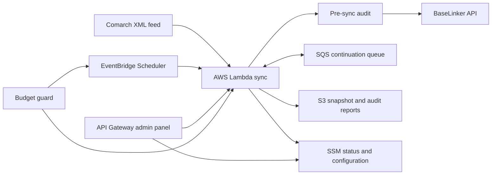

# Comarch e-Sklep → BaseLinker Sync

Serverless, audit-driven synchronization of a Comarch e-Sklep product catalog
with BaseLinker. The project was built for a real-world client deployment after
the native integration proved too limited for reliable variant relationships,
stock filtering, repeatable updates, and operational visibility.

No customer data, credentials, catalog exports, account IDs, or deployment
values are stored in this repository.

## What it does

- downloads one immutable Comarch XML snapshot per synchronization run,
- performs a full pre-sync audit against BaseLinker,
- creates, updates, and deletes only records found in the diff,
- preserves parent, variant, and standalone-variant relationships,
- filters zero-stock variants while retaining valid parent products,
- respects the BaseLinker API request limit,
- resumes work through SQS instead of paying for idle Lambda sleep,
- runs a post-sync audit and stores summarized audit output in S3,
- exposes a password-protected administration panel through API Gateway,
- publishes progress and ETA through SSM Parameter Store,
- includes an AWS budget guard that can pause scheduled processing.

## Architecture



## Repository layout

- `src/` - main synchronization Lambda.
- `admin_src/` - password-protected status and configuration panel.
- `budget_guard_src/` - budget protection Lambda.
- `cdk_app/` - complete AWS CDK infrastructure.
- `tests/` - unit tests.
- `comarch_template_full_flat.xml` - Comarch custom comparison template that
  exports products and all available attributes.

## Local tests

```bash
python3 -m venv .venv
source .venv/bin/activate
pip install -r requirements-dev.txt -r cdk_app/requirements.txt
python -m unittest discover -s tests -p 'test_*.py'
```

## Configuration

Copy `.env.example` to `.env` for local work. `.env` is ignored by Git.

The deployment workflow reads these GitHub Actions secrets:

| Secret | Purpose |
| --- | --- |
| `AWS_ACCESS_KEY_ID` | AWS deployment credentials |
| `AWS_SECRET_ACCESS_KEY` | AWS deployment credentials |
| `AWS_REGION` | Deployment region, for example `eu-north-1` |
| `PIPELINE_STACK_NAME` | Existing or new CDK pipeline stack name |
| `BUDGET_STACK_NAME` | Existing or new CDK budget stack name |
| `BUCKET_NAME` | Existing or new S3 bucket name |
| `FUNCTION_NAME` | Main Lambda name |
| `SCHEDULE_NAME` | Daily EventBridge Scheduler name |
| `ADMIN_API_NAME` | Admin HTTP API name |
| `ADMIN_FUNCTION_NAME` | Admin Lambda name |
| `BUDGET_NAME` | AWS Budget name |
| `BUDGET_GUARD_FUNCTION_NAME` | Budget guard Lambda name |
| `BUDGET_GUARD_MONTHLY_SCHEDULE_NAME` | Monthly reset schedule |
| `BUDGET_GUARD_HOURLY_SCHEDULE_NAME` | Hourly budget check schedule |
| `COMARCH_XML_URL` | Private Comarch XML export URL |
| `BL_API_TOKEN` | BaseLinker API token |
| `BL_API_TOKEN_SSM_PARAM` | SecureString parameter path |
| `BL_SYNC_STATUS_SSM_PARAM` | SSM synchronization status path |
| `BL_SYNC_CONFIG_SSM_PARAM` | SSM runtime configuration path |
| `BUDGET_FX_RATE_SSM_PARAM` | SSM USD/PLN rate path |
| `BUDGET_GUARD_STATUS_SSM_PARAM` | SSM budget guard status path |
| `BL_INVENTORY_ID` | Target BaseLinker inventory |
| `BL_WAREHOUSE_ID` | Target BaseLinker warehouse |
| `BL_API_MAX_RPM` | Request limit, normally below BaseLinker's hard limit |
| `MAKE_PUBLIC_FEED` | Keep `false` unless public S3 access is intentional |
| `ADMIN_USERNAME` | Admin panel username |
| `ADMIN_PASSWORD` | Admin panel password |
| `CLIENT_BRAND_NAME` | Private customer display name |
| `CLIENT_PANEL_TITLE` | Private admin panel heading |
| `CLIENT_PANEL_SUBTITLE` | Private admin panel subtitle |
| `CLIENT_PRIMARY_COLOR` | Customer primary color as six-digit hex |
| `CLIENT_PRIMARY_DARK_COLOR` | Dark primary color as six-digit hex |
| `CLIENT_SECONDARY_COLOR` | Customer secondary color as six-digit hex |
| `CLIENT_LOGO_BASE64` | Private PNG logo encoded as Base64 |
| `BUDGET_ALERT_EMAIL` | AWS Budget notification address |
| `BUDGET_LIMIT_USD` | Monthly budget limit |

The deployment is intentionally manual through **Actions → Deploy to AWS →
Run workflow**. A normal push runs tests and CDK synthesis only.

## Security notes

- BaseLinker tokens are copied by CI to SSM Parameter Store as `SecureString`.
- The admin password is hashed before it reaches the Lambda environment.
- Customer branding is stored only in GitHub Actions secrets. The logo is
  reconstructed on the ephemeral runner immediately before CDK packages the
  admin Lambda and is ignored by Git.
- S3 public access is disabled by default.
- Lambda reserved concurrency defaults to `1`.
- Never paste real feed URLs or credentials into issues, commits, or workflow
  inputs.

## License

MIT
